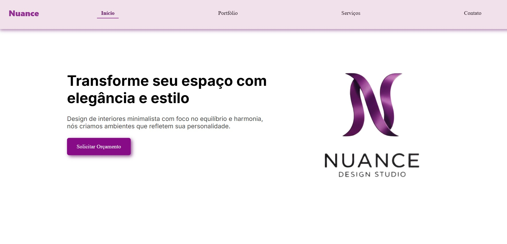

# Nuance - Design de Interiores

Um projeto de design de interiores que oferece soluções elegantes para transformar ambientes. Com foco no equilíbrio e harmonia, a plataforma permite aos usuários visualizar serviços de design e entrar em contato diretamente via WhatsApp para solicitar orçamentos personalizados.

## Tecnologias Utilizadas

- React
- HTML5, CSS3
- JavaScript

